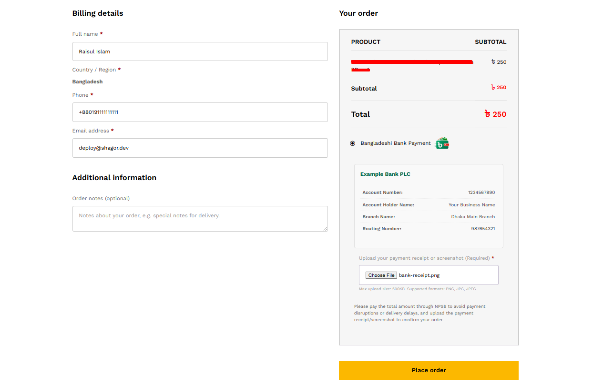
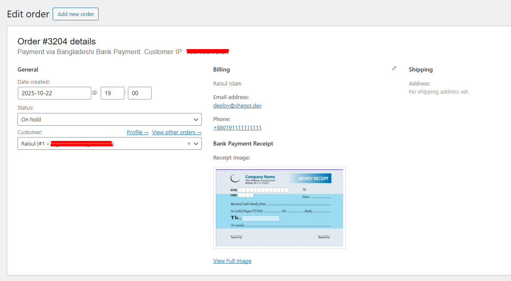

# 🏦 Bangladeshi Bank Payment Method

A custom WooCommerce payment gateway for Bangladeshi businesses, enabling customers to securely upload a receipt or screenshot of their bank or mobile banking payment confirmation during checkout for easy, manual verification.
---

## 📌 Plugin Information
- **Contributors:** shagor447  
- **Tags:** woocommerce, payment gateway, bangladesh bank transfer, manual payment, bangladeshi bank payment gateway
- **Requires at least:** WordPress 6.0  
- **Tested up to:** WordPress 6.9  
- **Requires PHP:** 7.4  
- **Stable tag:** 1.0.6 
- **License:** [GPLv3 or later](https://www.gnu.org/licenses/gpl-3.0.html)

---

## 📖 Description
This plugin adds a secure Bank Payment with Receipt Upload option to your WooCommerce store, specially designed for merchants and customers in Bangladesh. Instead of just entering a transaction ID, customers can upload a screenshot or photo of their bank payment receipt (e.g., mobile banking confirmation) directly on the checkout page. The uploaded image is securely stored and displayed in the order details for easy manual verification by the store admin. This is perfect for businesses that require visual proof of payment before processing orders.
---

## ✨ Features
- Accept bank transfer payments from any Bangladeshi bank (City Bank, IFIC BANK, UCB Bank, Islami Bank etc.).
- Customers upload a payment receipt image (PNG/JPG) during checkout.
- Automatic file validation (max 1MB, only images allowed).
- Displays your bank account details clearly on the checkout page.
- Fully compatible with WooCommerce emails, order statuses, and cart flow.
- You can change your bank icon, which will make it visually clear and easier for customers to understand.
- No sensitive data stored — secure and lightweight.

---

## ⚙️ Installation
- Upload the `bangladeshi-bank-payment-method` folder to the `/wp-content/plugins/` directory.
- Activate the plugin through the 'Plugins' menu in WordPress.
- Go to WooCommerce -> Settings -> Payments.
- Locate "Bangladeshi Bank Payment Method" and click 'Manage'.
- Configure your bank account details and save the changes.
- Customers will now see this option at checkout and can upload their payment proof.

---

## ❓ Frequently Asked Questions

### 🔹 Can customers use this with any Bank App?
Yes! Customers can upload a screenshot of their Bank transaction confirmation as the payment receipt.

### 🔹 What file types and sizes are allowed?
Only JPG, JPEG, and PNG images are accepted. The maximum file size allowed is 500KB.

### 🔹 Where can I see the uploaded receipt?
Go to WooCommerce → Orders → [Order]. The receipt image appears under the billing address section.

### 🔹 Does this plugin auto-verify payments?
No. Payments are marked as "On Hold" until you manually verify the uploaded receipt.

---

## 🖼️ Screenshots
1. Checkout page overview (customer view). 
2. View uploaded payment receipt in order details. 
3. Bank account setup and management in payment settings. 

---

## 📝 Changelog

###1.0.6
- Fixed: Image upload size increased to 1MB.
- Tested with the latest WordPress version.
- Fixed minor bugs.

### 1.0.5
- Fix: Missing data.

### 1.0.4
- Major fix: Resolved critical conflict where inline script usage broke file upload functionality.
- Compliance: Removed direct inline <script> tag to adhere to WordPress plugin submission guidelines.
- Fix: Ensured file size validation and AJAX disable logic now function correctly using standard JS enqueuing methods.

### 1.0.3
- Disabled WooCommerce AJAX checkout when this gateway is selected to ensure file uploads work reliably.
- Improved JavaScript isolation and form handling.

### 1.0.2
- Fixed "Please upload a payment receipt" error on checkout.
- Added proper translators comment and PHPCS compliance.
- Enhanced security and file validation.

### 1.0.1
- Minor CSS and UI improvements.
- Better error handling for file uploads.

### 1.0.0
- Initial release.

---

## 📢 Update Notice
= 1.0.6 = Version 1.0.6 has been released as a stable version.

## ⚖️ License & Copyright
- Copyright © **Raisul Islam Shagor** 
- Email: deploy@raisul.dev
- Website: https://raisul.dev/
- Conatct: https://raisul.dev/contact
- Licensed under the **GPLv3 or later**  
- ✅ This plugin is **free to use, modify, and distribute** under the license terms.
